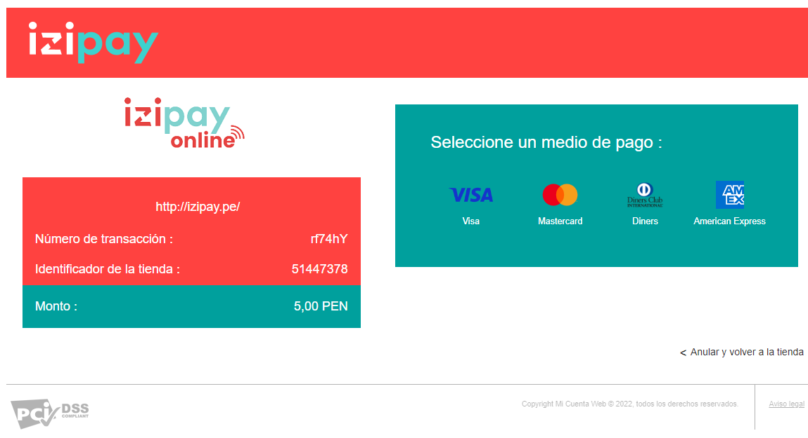
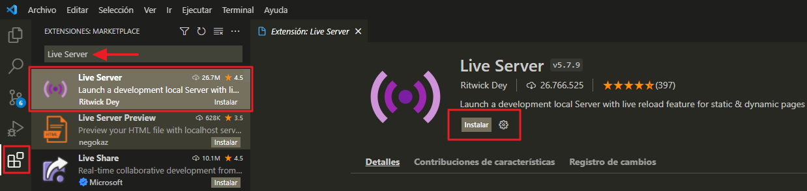
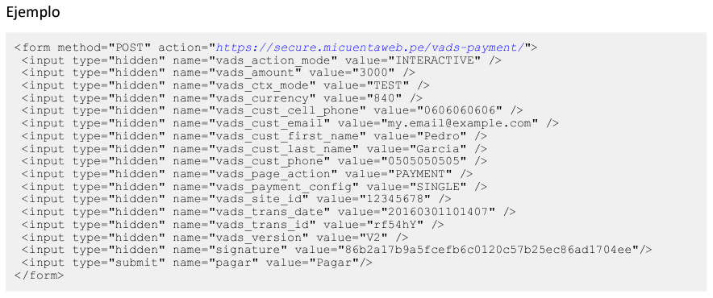

# Redirect-PaymentFormT1-JavaScript

Ejemplo del formulario en REDIRECCIÓN de Izipay con JavaScript, para poder ejecutar el siguiente ejemplo seguir los pasos del presente manual.



<a name="Requisitos_Previos"></a>
## Requisitos Previos

* Extraer credenciales del Back Office Vendedor. [Guía Aquí](https://github.com/izipay-pe/obtener-credenciales-de-conexion)
* Descargar el manual desde [Manual Izipay - implementación en REDIRECCIÓN](https://secure.micuentaweb.pe/doc/es-PE/form-payment/quick-start-guide/sitemap.html).
* Instalar Visual Studio Cod [Aquí](https://code.visualstudio.com/) o el editor de texto de su preferencia, para este manual utilizaremos Visual Studio Cod.


## 1.- Crear el proyecto
* Descargar el proyecto .zip haciendo click [Aquí](https://github.com/izipay-pe/Redirect-PaymentFormT1-JavaScript/archive/refs/heads/main.zip) o clonarlo desde Git.
  ```sh
  git clone https://github.com/izipay-pe/Redirect-PaymentFormT1-JavaScript.git
  ``` 

* Para ejecutar este proyecto de manera local utilizaremos una extensión de Visual Studio Cod que simulara un servidor web, para instalar esta extensión abrimos Visual Studio Cod y en la parte izquierda nos dirigimos a `Extensiones` y digitamos en el buscador `Live Server` he instalamos la extensión.  

    

* Descomprimimos el archivo descargado `Redirect-PaymentFormT1-JavaScript-main.zip`, se extraerá la carpeta Redirect-PaymentFormT1-JavaScript-main seleccionamos esta carpeta y la abrimos con Visual Studio Cod.

* Ingresamos a la siguiente ruta `scr/index.hmtl` y le damos click derecho dentro del código HTML, buscamos `open with Live Server` para ejecutar, se abrirá en nuestro navegador el proyecto con el siguiente dominio y podrá ver el resultado en: 

  - "http://127.0.0.1:5501/scr/index.html"


## 2.- Configurar datos de conexión

**Nota**: Reemplace **[CHANGE_ME]** con su credencial de `Claves` extraída desde el Back Office Vendedor, ver [Requisitos Previos](#Requisitos_Previos).

* Editar el archivo en la siguiente ruta `Redirect-PaymentFormT1-JavaScript-main -> src -> index.html` con las claves de su Back Office Vendedor.

  - Ingresar el `Identificador de la tienda` del Back Office Vendedor en el parámetro `value`.

  ```html   
    <div class="inputContainer">
      <input id="campo7" type="text" class="input" placeholder="" name="vads_site_id" value="~~CHANGE_ME_id~~" readonly />             
      <label for="" class="label">vads_site_id / (CODIGO DE LA TIENDA)</label>
    </div>
  ```

  - Ingresar la `Clave de test o Clave de producción` de Back Office Vendedor en el parámetro `value`.

  ```html   
    <input id="key" type="hidden" value="~~CHANGE_ME_key~~" />  
  ```

* Para los demás campos verificar el manual descargado en los [Requisitos Previos](#Requisitos_Previos).

  - En el capítulo `5. ENVIAR UN FORMULARIO DE PAGO EN POST` se describe todos los datos que podemos enviar en nuestro formulario de pago, `en la pagina 21` se muestra un ejemplo de como se debería estructurar el html y como se pueden enviar dentro de nuestro formulario de pago.
    
    

  - Para los campos que tienen un valor ya establecido en `value` se recomienda que los cambie solo cuando verifique el manual y los datos del parámetro que está modificando, se recomienda dejar los valores predefinidos para este ejemplo.

    Ejemplo 1: Para el campo `vads_action_mode` que se define como un: *Modo de adquisición de la información del medio de pago*, el valor que indica el manual es el `INTERACTIVE`, por ese motivo se predefine este campo y se bloquea con `readonly` para no ser editado.

    ```html
      <div class="inputContainer">
        <input id="campo1" type="text" class="input" placeholder="" name="vads_action_mode" value="INTERACTIVE" readonly />             
        <label for="" class="label">vads_action_mode</label>
      </div>
    ```

    Ejemplo 2: Para el campo `vads_amount` que se define como el: *Monto del pago en su unidad monetaria más pequeña que es el centavo o céntimos)*, este campo puede ser editado y no tiene un valor predefinido, ya que enviara el monto a pagar en el formulario y depende del usuario.

    ```html
      <div class="inputContainer">
        <input id="campo2" type="text" class="input" placeholder="" name="vads_amount" value="" />             
        <label for="" class="label">vads_amount / (MONTO A PAGAR)</label>
      </div>
    ```


## 3.- Transacción de prueba

El formulario de pago está listo, puede intentar realizar una transacción utilizando una tarjeta de prueba. 

Puede consultar las tarjetas de prueba desde este enlace: [Tarjetas de Prueba](https://secure.micuentaweb.pe/doc/es-PE/rest/V4.0/api/kb/test_cards.html).

   * Tarjeta de prueba Visa:
      - *Número de tarjeta*: 4970100000000055
      - *Fecha de vencimiento*: 12/30   
      - *Código de seguridad*: 123
 
## 4.- Implementar IPN

* Ver manual de implementación de la IPN [Aquí](https://secure.micuentaweb.pe/doc/es-PE/rest/V4.0/kb/payment_done.html)

* Ver el ejemplo de la respuesta IPN con PHP [Aquí](https://github.com/izipay-pe/Redirect-PaymentForm-IpnT1-PHP)

* Ver el ejemplo de la respuesta IPN con NODE.JS [Aquí](https://github.com/izipay-pe/Response-PaymentFormT1-Ipn)
